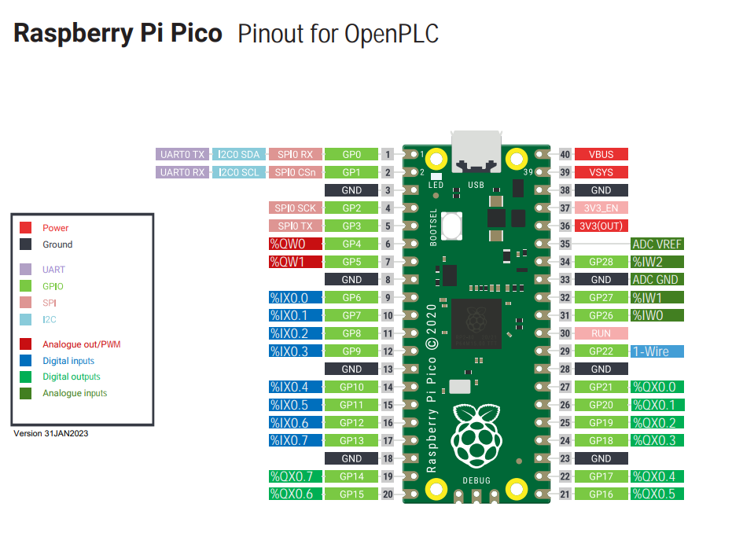
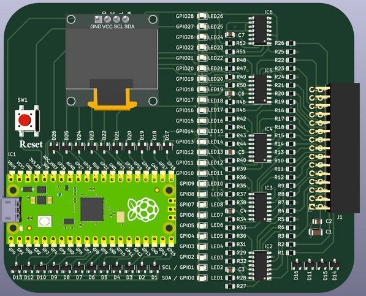
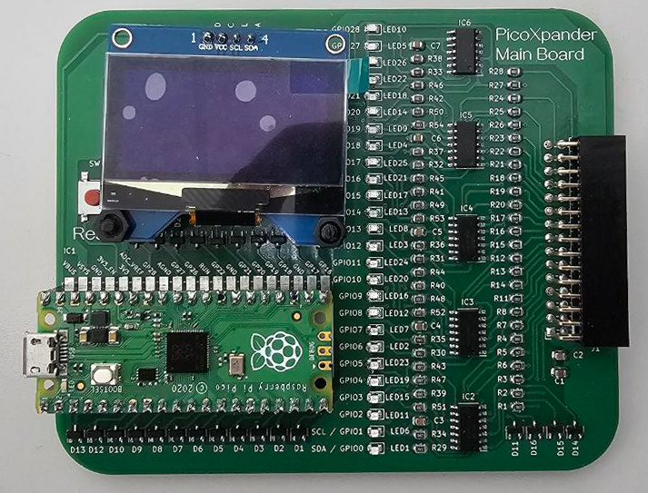
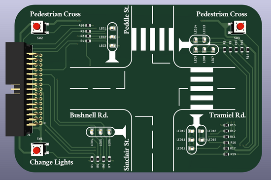
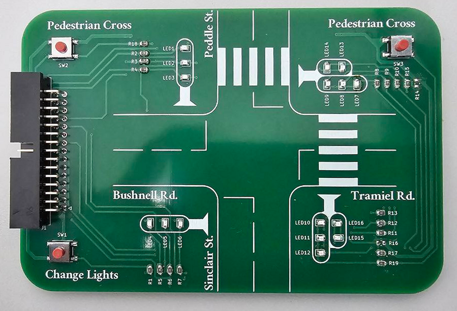
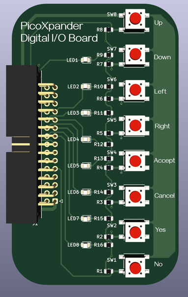
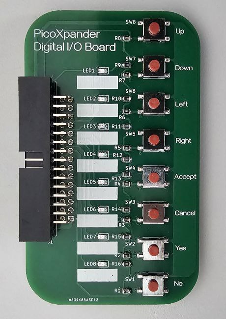
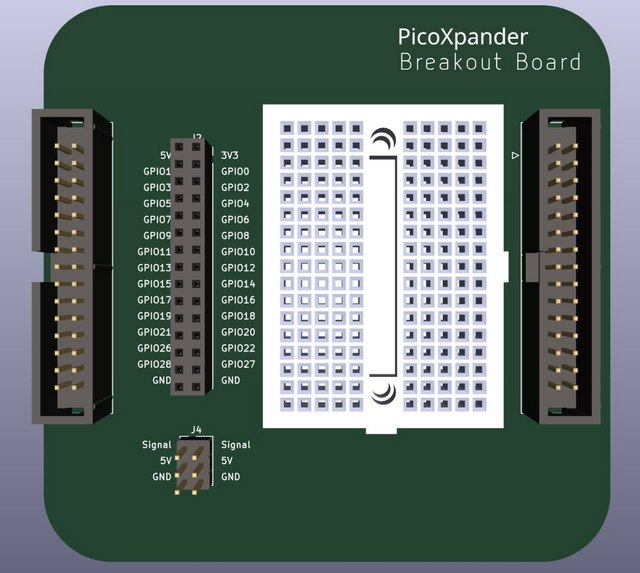

# Tangible Learning for IoT and Automation ... 
in a Lunchbox - the picoXpander

This repo is the design files and sample code for the picoXpander kit. It is kit that leverages the Raspberry pico boards (RP2040 & RP2350) as a controller along with various IO boards the connect up using a short ribbon cable. The goal of this kit was to use simple technology to make an interesting electronics kit for teaching at a very affordable price. The focus of the learning is on the programming and understanding logic. This reduces the reliance on the connection and wiring up of individual components which take more time to get right. 

The Lunch box idea idea was create boards that are small enough to fit into a 1L box (about 160L x 113W x 90H mm in size. Like this one from [Living & Co.](https://www.thewarehouse.co.nz/p/living-co-storage-container-rectangle-assorted-1l/R2039528.html)), including the cable. This meant it was easy to keep the kit together and carry around. The 1L box has enough room to fit about 6-7 boards and the USB cable.

## Software

The kit IO layout was arranged to match the [picoPLC](https://github.com/yonush/PicoPLC) arrangement so that you can write your applications using [OpenPLC](https://autonomylogic.com/). This does not mean you cant remap them when using CircuitPython, Micropython or C/C++.

Pinout used by the picoXpander and picoPLC

### Using Blinka from Adafruit

Support has been added to work with the Adafruit Blinka platform with some caveats. IN order to match the above pinout and work with the piocPLC there were several changes made to the Adafruit Blinka module. With a summary of the changes below. A more detailed writeup can be found in the [readme](blinka/READ.me) for the picoXpander blinka distribution.

**Changes made to adafruit_blinka module**

The picoXpander driver board uses an off the shelf Raspberry Pico device which means there were no changes made to the USB HID (device VID) settings. We modified the existing rp2040_u2if driver, changes can be found in the blinka folder.

## The boards in brief

There are seven boards identified for the kit with three of them already designed and tested with the other four in progress

- :white_check_mark: Raspberry Pico driver board
- :white_check_mark: Traffic light crossing
- :white_check_mark: 8bit digital I/O
- :white_large_square: Three floor elevator
- :white_large_square: 16x8 LED display
- :white_check_mark: Breakout & passthrough board
- :white_large_square: Multiple sensor board
- :white_large_square: Motor/Servo driver board

### The picoXpander driver board

This board contains a socket for the Pico which also provision for direct soldering of the pico to the board. There is a room for a small I2C OLED display. (supports 0.91", 0.96", 1.3", 1.5" and 2.43" displays). 

- It is 106x88mm in size
- There are 26 buffered LEDs, one for each of the GPIO pins  than connect to the . 
- No external power required.
- Has a convenient reset button
- The I2C can be remapped to "network" two boards using the UART.

### Traffic crossing

This simulates 4 way crossing with a pedestrian light for two of the roads. 

- It is 130x88mm in size
- Three buttons to interact with the lights
- 16 LEDs arrange as 3 per intersection. opposite traffic lights are tied together
- No external power required.

### 8bit Digital IO board

A simple board the maps against the 8 digital inputs and 8 digital outputs. The labels of the buttons are not tied to a specific function but can be used as identifiers.

### Three floor elevator

A board to simulate a elevator with 3 floors.

- 1 button for each floor to call the elevator 
- 2 LEDs to indicate elevator traveling up or down
- 3 buttons for the inside of the elevator
- 4-8 LEDs in a box to represent the elevator at each floor

*Design currently under development.*

### 16x9 LED display

Contains a 16x9 Charlieplexed LED matrix to present a very simple display driven by the rather convenient IS31FL3731 LED display chip.

- 16x9 LEDs (colour yet to be determined)
- 1x 4 way button joystick
- 2x additional buttons for interaction
- 1x Haptic feedback motor

*Design currently under development.*

### Breakout & passthrough board

This board can either be attach to the driver board or between the driver board and another board. It provides the IO passthrough but also a header to allow you to attach dupont leads. A small breadboard is also attached to let you add components not found on the fixed function boards. A 6pin header has been added to provide connectivity for two small servos such as the [MG90S](https://components101.com/motors/mg90s-metal-gear-servo-motor) and the [SG90](https://components101.com/motors/servo-motor-basics-pinout-datasheet).

### Multiple sensor board

This board contains several common sensors and a a couple of RGB LEDs. Starting with the smart sensor BME688. It is an air quality sensor can measure gas, temperature, pressure and humiditthe first gas sensor with Artificial Intelligence  

Sensor list

- Light sensor
- Sound
- Air quality
- Temperature
- Humidity
- Motion
- Pressure

*Design currently under development.*

### Motor/Servo driver board

This board will have a motor driver for two motors to let you attach the pixoXpander to a chassi

- 1x H-bridge motor driver, with built-in short circuit, over current and thermal protection.
- [alt] DRV8833 motor driver using I2C - 1A per motor
- [alt] MX1508 motor driver using PWM - 1.5A per motor
- 2x motors or 1x stepper
- Uses external power with on board charger for a battery
- 4x servo outputs
- power switch for the external power

*Design currently under development.*

## Demo code

*Under development*

-end-of-file-
